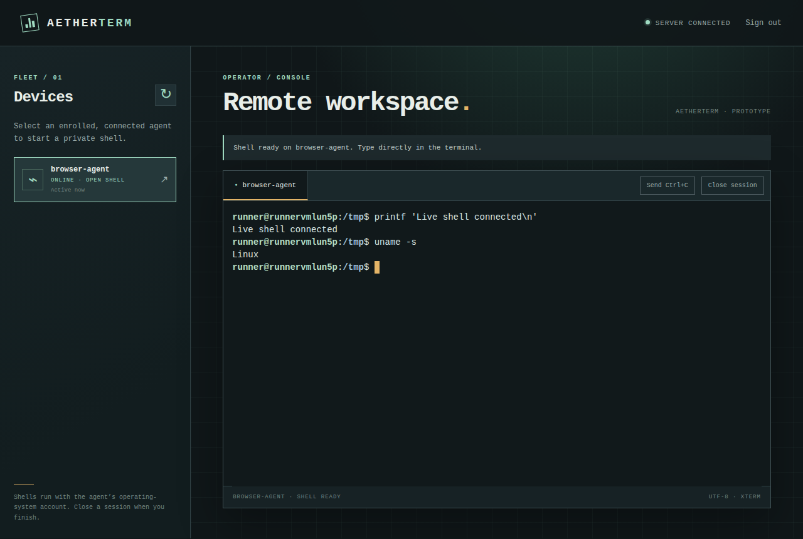
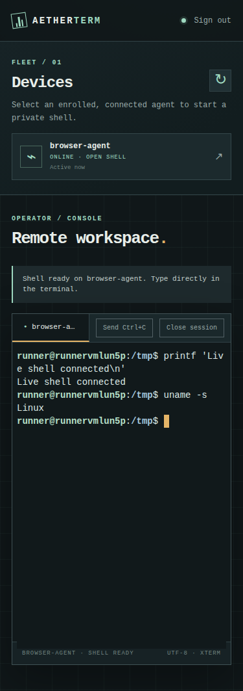

# AetherTerm

An early prototype that relays a shell on an agent machine to a browser through a FastAPI WebSocket server. It is **not ready for network deployment**.





These are real browser captures from the [Ubuntu CI run for `dbaf5e9`](https://github.com/OthmaneBlial/AetherTerm/actions/runs/35446357041), with a disposable agent and PTY. The [capture record](docs/SCREENSHOTS.md) identifies their source and limits.

> **Security warning:** operator sign-in and per-device agent credentials are implemented. The documented local run uses plain `ws://`; a TLS option has only been checked locally with a temporary certificate. Keep the server bound to loopback while the [security roadmap](ROADMAP.md) is implemented. Do not use this revision for production administration or expose it to a LAN or the Internet.

## What exists today

- A Python FastAPI server with browser (`/ws`) and agent (`/client`) WebSocket endpoints.
- A Python agent that creates a `/bin/bash` PTY on request.
- An operator password login and a bundled xterm.js console that lists enrolled devices and opens interactive shells. Sessions are tied to the browser WebSocket that opened them. The terminal toolbar can send Ctrl+C to a foreground process.
- Device-bound agent credentials stored in owner-readable files, with server-side rotation and revocation.
- Agent reconnection attempts after connection failures, plus isolated PTYs for simultaneous local sessions. Existing shells close after disconnection; a returning agent needs a new session.

The browser terminal uses locally bundled xterm.js. Unicode paste, ANSI colors, `less`, the Ctrl+C toolbar action and resize have been exercised on macOS in Chrome. The Linux Chromium CI journey also checks shell output, Unicode rendering and the Ctrl+C action; `vim`, arrow keys and real touch input still need validation. The page derives its WebSocket URL from the page origin, but remote HTTPS/WSS deployment has not been validated outside a local proxy test. Operator and agent credentials are created outside the repository; no working defaults are shipped.

## Loopback-only development run

The [local quickstart](docs/QUICKSTART.md) includes the full first-shell sequence, a second identity, rotation and shutdown.

This flow was exercised on macOS with Python 3.13. It is a local prototype run, not a supported release or a Linux compatibility claim. From the project root:

```bash
python3.13 -m venv .venv
source .venv/bin/activate
python -m pip install .
aetherterm-admin init
aetherterm-admin enroll local-agent --output ~/.config/aetherterm/local-agent.token
```

The operator setup prompts for a password of at least 12 characters. Keep the generated credential file private. Add `--description "My Linux host"` to `enroll` if you want a label in the console. Enrolled devices stay visible when offline; their “last seen” time is remembered only while this server process runs.

In a second terminal, start the server:

```bash
source .venv/bin/activate
aetherterm-server --port 8001
```

In a third terminal, run the agent under the OS account whose shell you intend to use:

```bash
source .venv/bin/activate
aetherterm-agent --host 127.0.0.1 --port 8001 --device-id local-agent --token-file ~/.config/aetherterm/local-agent.token
```

Open `http://127.0.0.1:8001/web/` and sign in. Use `aetherterm-admin rotate local-agent --output <new-private-file>` to replace a device credential, or `aetherterm-admin revoke local-agent` to disable it. These commands change the server registry; restart the agent with the new file after rotation. Do not put credential files in Git or pass their contents through command arguments. The proposed remote TLS topology and its current evidence are in [the deployment guide](docs/DEPLOYMENT.md).

The terminal UI is bundled locally; no CDN connection is needed. To rebuild it after changing `web/src/`, run `cd web && npm ci && npm run build`. The checked-in `web/assets/` files let the Python quickstart work without Node. xterm.js and its fit addon are MIT licensed; their notices are in `web/licenses/`.

The [installation guide](docs/INSTALL.md) describes the wheel and the Linux server container currently exercised in CI. Neither is a published release download yet.

The agent reconnects automatically after a temporary server outage with bounded backoff. Existing shells close when either side disconnects; open a new session after reconnection. An invalid agent credential or rejected WSS certificate stops the agent so the operator can correct the configuration.

## Intended product

The proposed first release is a self-hosted console for one operator and multiple explicitly enrolled Linux agents. Browser sign-in, per-browser session ownership and device credentials have integration tests. Verified HTTPS/WSS for remote access is still required. The [architecture](docs/ARCHITECTURE.md), [product contract](docs/PRODUCT.md), [threat model](docs/THREAT_MODEL.md), [security guide](docs/SECURITY.md) and [operations guide](docs/OPERATIONS.md) describe how the current code works and what the release must still prove.

AetherTerm does not speak SSH. Compatibility, security and ease-of-use comparisons with other projects have not been measured yet. The [roadmap](ROADMAP.md) defines the work and evidence required before a release and before a real product demonstration video.

## Development status

| Area | Current evidence | Release requirement |
| --- | --- | --- |
| Shell relay | Two independent PTYs, explicit close, browser disconnect, agent SIGTERM/SIGINT and server restart have integration tests on macOS and passed on a Linux CI runner. Chrome manually showed Unicode, ANSI colors, `less`, Ctrl+C and resize. | Remaining graphical terminal interactions and real deployment validation. |
| Browser access | Password login, cookie session, same-origin WebSocket and negative cross-browser integration test. The sole operator can access every enrolled active device. | Expiry/revocation under load, external deployment and independent security review. |
| Agent identity | Per-device credential-file enrollment, rotation and revocation tested locally. | Remote encrypted transport, Linux installation and operating guidance. |
| Transport | Remote cleartext refused in code; direct TLS and a local Caddy HTTPS/WSS proxy test with certificate validation passed. | Public certificate, external network and graphical browser validation. |
| Packaging and automation | A wheel installed in clean Python 3.13 environments served its bundled UI and completed an authorized PTY round trip on macOS and Ubuntu 24.04 CI. A non-root server container, dependency scans and the Chromium journey passed in the [CI run for `dbaf5e9`](https://github.com/OthmaneBlial/AetherTerm/actions/runs/35446357041). No published release artifact is verified. | Standalone Linux agent, tested downloads, review gates and release checks. |

The MIT license is in [LICENSE](LICENSE). Contributions are welcome once the security and test setup are documented; please avoid deploying this revision to a reachable network. The complete sequence is tracked in [ROADMAP.md](ROADMAP.md).
